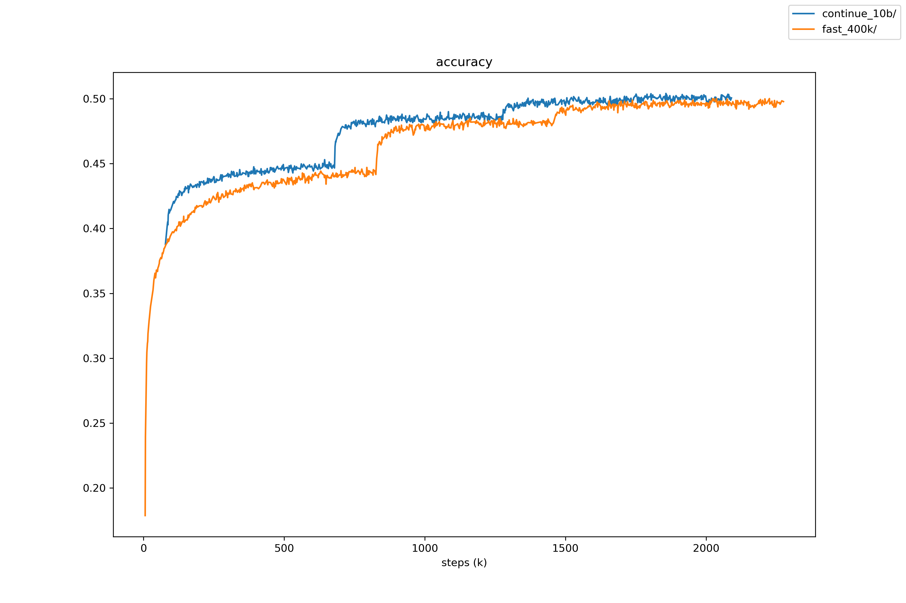
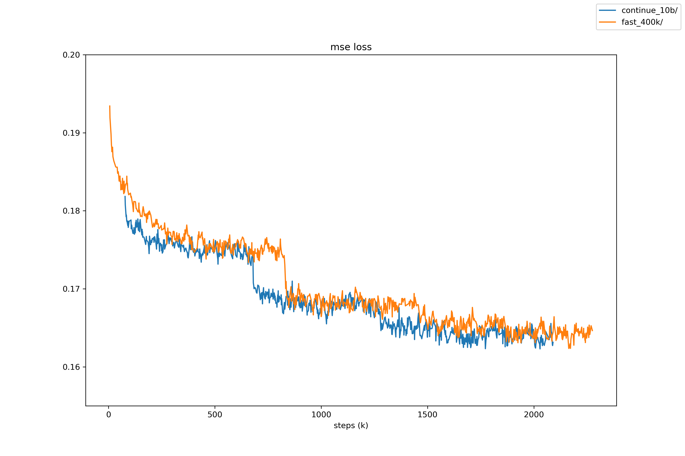
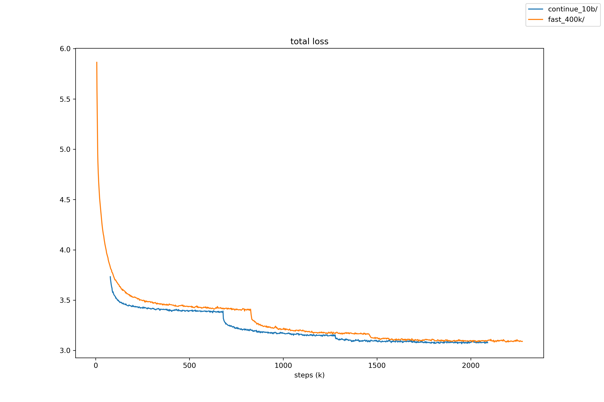

## Continue from last 10b weight

Use the last 10b net as the initial net and continue from that point using new
data, then compare its strength with the 10b net that training from scratch.

### Training settings

The minimum epoch steps are both 400k and the same code in this branch is used.

### Test settings

1600 playouts, no ponder, Leela Zero master branch engine.

### Result

```
continue_10b v fast_lr_drop (100 games)
board size: 19   komi: 7.5
               wins              black         white       avg cpu
continue_10b     49 49.00%       21 42.00%     28 56.00%    139.14
fast_lr_drop     51 51.00%       22 44.00%     29 58.00%    139.78
                                 43 43.00%     57 57.00%

player continue_10b: Leela Zero:0.15
player fast_lr_drop: Leela Zero:0.15
```

### Training graph



