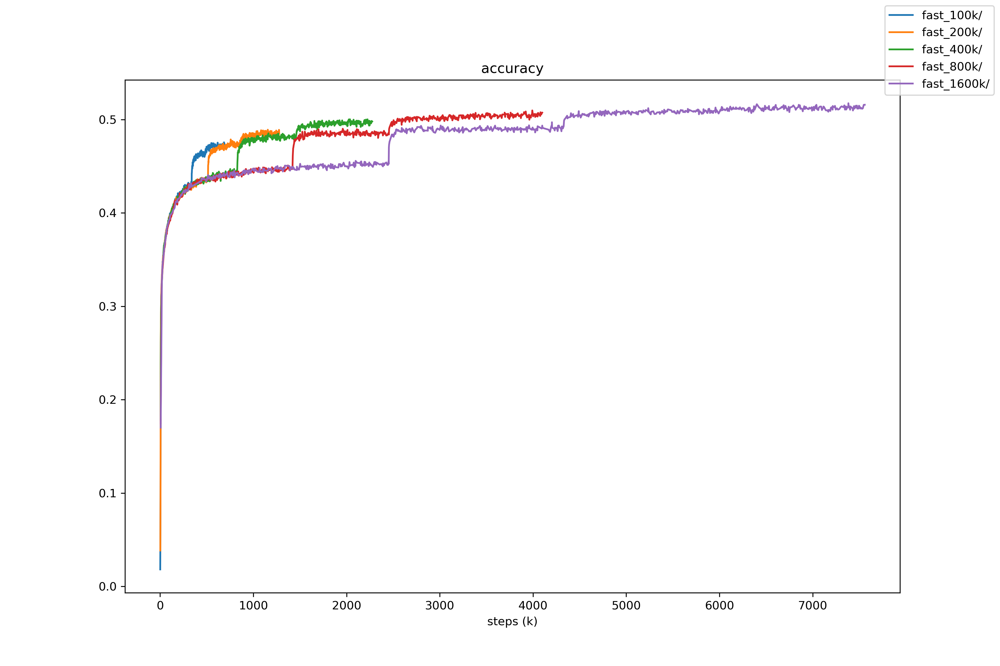
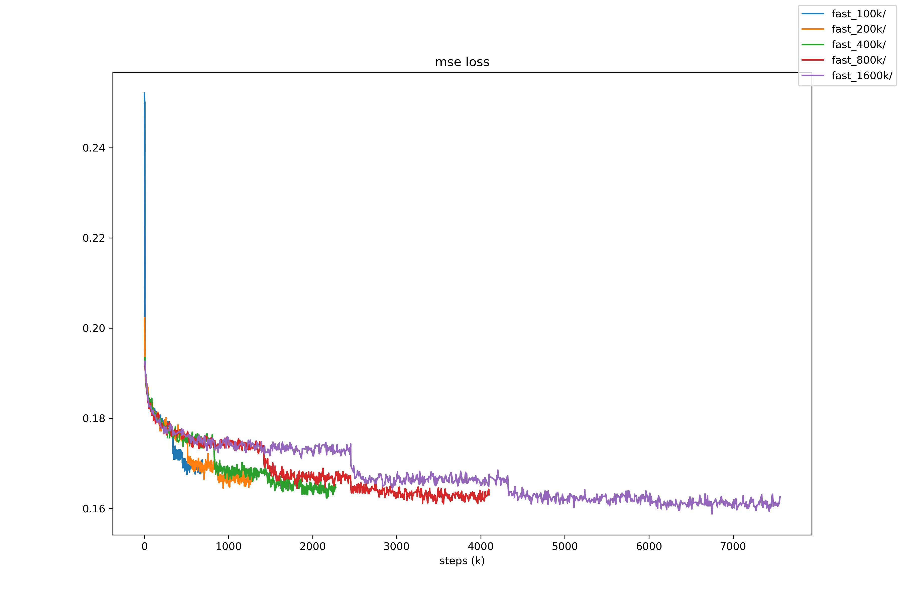
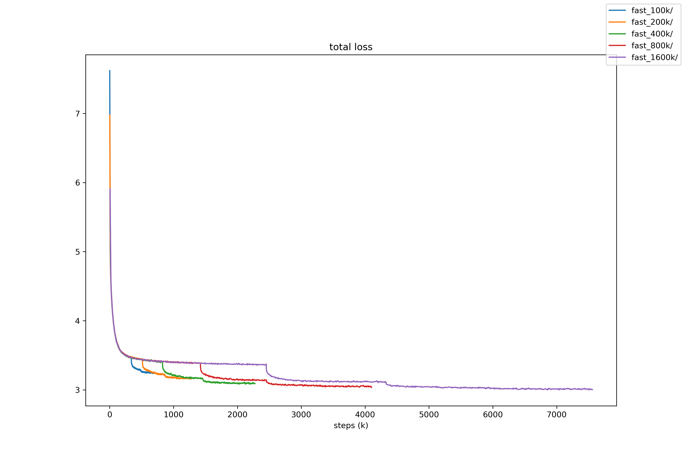

## Different minimum steps before learning rate drop

Drop learning rate at least after 100k/200k/400k/800k/1600k steps.

### Training settings

Except different epoch steps, all settings are default as in training code.

### Test settings

1600 playouts, no ponder, Leela Zero master branch engine.

### Result

#### Internal matches

100k vs 400k
```
fast_lr_100k v fast_lr_400k (84 games)
board size: 19   komi: 7.5
               wins              black         white       avg cpu
fast_lr_100k      3  3.57%       2   4.76%     1   2.38%    144.11
fast_lr_400k     81 96.43%       41 97.62%     40 95.24%    141.06
                                 43 51.19%     41 48.81%

player fast_lr_100k: Leela Zero:0.15
player fast_lr_400k: Leela Zero:0.15
```

200k vs 400k
```
fast_lr_200k v fast_lr_400k (100 games)
board size: 19   komi: 7.5
               wins              black         white       avg cpu
fast_lr_200k     22 22.00%       9  18.00%     13 26.00%    150.00
fast_lr_400k     78 78.00%       37 74.00%     41 82.00%    147.39
                                 46 46.00%     54 54.00%

player fast_lr_200k: Leela Zero:0.15
player fast_lr_400k: Leela Zero:0.15
```

800k vs 400k
```
fast_lr_800k v fast_lr_400k (98 games)
board size: 19   komi: 7.5
               wins              black         white       avg cpu
fast_lr_800k     80 81.63%       38 77.55%     42 85.71%    132.30
fast_lr_400k     18 18.37%       7  14.29%     11 22.45%    136.12
                                 45 45.92%     53 54.08%

player fast_lr_400k: Leela Zero:0.15
player fast_lr_800k: Leela Zero:0.15
```

1600k vs 400k
```
fast_lr_1600k v fast_lr_400k (400 games)
board size: 19   komi: 7.5
                wins              black          white        avg cpu
fast_lr_1600k    358 89.50%       175 87.50%     183 91.50%    110.99
fast_lr_400k      42 10.50%       17   8.50%     25  12.50%    113.11
                                  192 48.00%     208 52.00%

player fast_lr_1600k: Leela Zero:0.15
player fast_lr_400k: Leela Zero:0.15
```

#### Baseline matches

400k vs last 10b
```
400k v lz_10b_base (102 games)
board size: 19   komi: 7.5
            wins              black         white       avg cpu
400k          58 56.86%       33 64.71%     25 49.02%    120.10
lz_10b_base   44 43.14%       26 50.98%     18 35.29%    120.09
                              59 57.84%     43 42.16%

player lz_10b_base: Leela Zero:0.15
player 400k: Leela Zero:0.15
```

800k vs last 10b
```
fast_lr_800k v lz_10b_base (101 games)
board size: 19   komi: 7.5
               wins              black         white       avg cpu
fast_lr_800k     77 76.24%       36 70.59%     41 82.00%     91.62
lz_10b_base      24 23.76%       9  18.00%     15 29.41%     92.03
                                 45 44.55%     56 55.45%

player fast_lr_800k: Leela Zero:0.15
player lz_10b_base: Leela Zero:0.15
```

1600k vs last 10b
```
fast_lr_1600k v lz_10b_base (896 games)
board size: 19   komi: 7.5
                wins              black          white        avg cpu
fast_lr_1600k    766 85.49%       367 81.92%     399 89.06%     87.06
lz_10b_base      130 14.51%       49  10.94%     81  18.08%     87.92
                                  416 46.43%     480 53.57%

player fast_lr_1600k: Leela Zero:0.15
player lz_10b_base: Leela Zero:0.15
```

1600k vs first 15b
```
fast_lr_1600k v lz_15b_base (400 games)
board size: 19   komi: 7.5
                wins              black          white        avg cpu
fast_lr_1600k    221 55.25%       105 52.50%     116 58.00%    101.27
lz_15b_base      179 44.75%       84  42.00%     95  47.50%    188.41
                                  189 47.25%     211 52.75%

player fast_lr_1600k: Leela Zero:0.15
player lz_15b_base: Leela Zero:0.15
```

### Training graph

  
  
  

### Conclusion 

- The longer training steps, the stronger net. Even the result in loss and 
  accuracy is similar in 800k and 1600k, the performance is quite different.
- The training data shows that the training procedure is quite reproducible.
