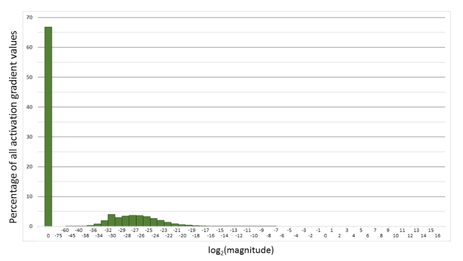
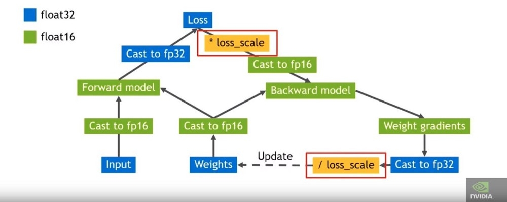

## Mixed Precision Training Support

Mixed precision is the combined use of different numerical precisions in a computational method. Using precision lower than FP32 reduces memory usage, allowing deployment of larger networks. Data transfers take less time, and compute performance increases, especially on GPUs with Tensor Core support for that precision.

Mixed precision training of deep neural networks achieves two main objectives:  
- **Decreases the required amount of memory enabling training of larger models**  
- **Training with larger mini-batches and shortens the training or inference time by lowering the required resources by using lower-precision arithmetic**

### Half Precision Format

Half precision (also known as FP16) data compared to higher precision FP32 vs FP64 reduces memory usage of the neural network, allowing training and deployment of larger networks, and FP16 data transfers take less time than FP32 or FP64 transfers.

Single precision (also known as 32-bit) is a common floating point format (`float` in C-derived programming languages), and 64-bit, known as double precision (`double`).

IEEE 754 standard defines the following 16-bit half-precision floating point format: 1 sign bit, 5 exponent bits, and 10 fractional bits.

Exponent is encoded with 15 as the bias, resulting [-14, 15] exponent range (two exponent values, 0 and 31, are reserved for special values). An implicit lead bit 1 is assumed for normalized values, just like in other IEEE floating point formats.

Half precision format leads to the following dynamic range and precision:  
**Normalized values:** 2^-14 to 2^15, 11 bits of significand  
**Denormal values:** 2^-24 to 2^-15, significand bits decrease as the exponent gets smaller. Exponent k in [-24, -15] range results in (25 - k) bits of significand precision.  

Some example magnitudes:  
**Maximum normalized:** 65,504  
**Minimum normalized:** 2^-14= ~6.10e-5  
**Minimum denormal** 2^-24= ~5.96e-8

### Loss Scaling To Preserve Small Gradient Magnitudes

Some networks require their gradient values to be shifted into FP16 representable range to match the accuracy of FP32 training sessions. The figure below illustrates one such case.

Figure 1. Histogram of activation gradient magnitudes throughout FP32 training of Multibox SSD network. The x-axis is logarithmic, except for the zero entry. For example, 66.8% of values were 0, 4% had magnitude in the (2^-32 , 2^-30) range.

However, this isn’t always the case. You may have to do some scaling and normalization to use FP16 during training.

Figure 2. Histogram of activation gradient magnitudes throughout FP32 training of Multibox SSD network. Both x- and y-axes are logarithmic.

Consider the histogram of activation gradient values (shown with linear and log y-scales above), collected across all layers during FP32 training of Multibox SSD detector network (VGG-D backbone). When converted to FP16, 31% of these values become zeros, leaving only 5.3% as non-zeros which for this network lead to divergence during training.

**Note:** Much of the FP16 representable range was left unused by the gradient values. Therefore, if we shift the gradient values to occupy more of that range, we can preserve many values that are otherwise lost to 0s.

For this particular network, shifting by 3 exponent values (multiply by 8) was sufficient to match the accuracy achieved with FP32 training by recovering the relevant values lost to 0. Shifting by 15 exponent values (multiplying by 32K) would recover all but 0.1% of values lost to 0 when converting to FP16 and still avoid overflow. In other words, FP16 dynamic range is sufficient for training, but gradients may have to be scaled to move them into the range to keep them from becoming zeros in FP16.

### High-Level Procedure for Training

Maintain a master copy of weights in FP32  
For each iteration:  
- Make an FP16 copy of the weights  
- Forward propagation (FP16 weights and activations)  
- Multiply the resulting loss with the scaling factor S  
- Backward propagation (FP16 weights, activations, and their gradients)  
- Multiply the weight gradient with 1/S  
- Complete the weight update (including gradient clipping, etc.)  

### Speed Benchmark

1080ti (no TensorCore)

|Architecture|Batch Size|FP32 Speed (pos/s)|FP16 Speed (pos/s)|Speed Boost|
|------------|----------|------------------|------------------|-----------|
|10x128      |128       |1300              |1490              |14.6%      |
|            |256       |1195              |1397              |16.9%      |
|            |512       |OOM*              |1358              |           |
|20x256      |128       |205               |337               |64.4%      |
|            |256       |OOM*              |278               |           |

2080ti (TensorCore)

|Architecture|Batch Size|FP32 Speed (pos/s)|FP16 Speed (pos/s)|Speed Boost|
|------------|----------|------------------|------------------|-----------|
|10x128      |128       |1752              |2543              |45.1%      |
|            |256       |1810              |2753              |52.1%      |
|            |512       |OOM*              |2529              |           |
|20x256      |128       |381               |562               |47.5%      |
|            |256       |OOM*              |251               |           |

OOM: Out of memory.

### Performance Benchmark

(WIP)

### More Information

- [Nvidia SDK](https://docs.nvidia.com/deeplearning/sdk/mixed-precision-training/index.html#training)  
- [NVIDIA Developer Blog](https://devblogs.nvidia.com/mixed-precision-training-deep-neural-networks/)  
- [RTX 2080Ti Vs GTX 1080Ti: fastai Mixed Precision training & comparisons on CIFAR-100](https://hackernoon.com/rtx-2080ti-vs-gtx-1080ti-fastai-mixed-precision-training-comparisons-on-cifar-100-761d8f615d7f)  
- [Nvidia Examples](https://github.com/godmoves/nvidia-examples)
- [TensorFlow FP16 training demo](https://github.com/khcs/fp16-demo-tf)
